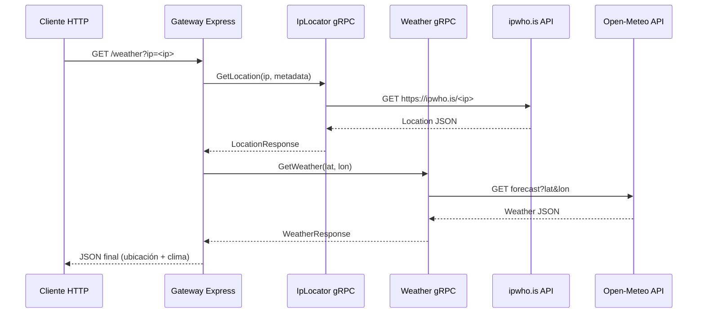

# Flujo Completo del Sistema de Microservicios de Clima

Este documento describe cómo funciona el sistema de tres microservicios que juntos permiten obtener la información del clima basada en la IP del cliente.

Los tres componentes son:

1. **Gateway (Node.js / Express)**  
2. **IpLocator (Python / gRPC)**  
3. **Weather (Python / gRPC)**



---

## 1. Cliente → Gateway

El flujo inicia cuando un cliente hace una petición HTTP al gateway:

curl "http://localhost:8080/weather?ip=190.104.234.174"

- Puede incluir un parámetro `ip`.

---

## 2. Gateway → IpLocator

El gateway llama al microservicio `IpLocator` mediante gRPC:

```javascript
ipClient.GetLocation({ ip }, meta, callback)
```

- Recibe la petición GetLocation(ip) y valida la IP.
- Llama a la API externa ipwho.is para resolver la IP a ubicación.
- Devuelve un mensaje protobuf LocationResponse con:

```json
{
  "location": {
    "ip": "200.32.1.5",
    "city": "Mar del Plata",
    "region": "Buenos Aires",
    "country": "AR",
    "latitude": -38.0023,
    "longitude": -57.5577
  }
}
```

- Si ocurre un error, devuelve LocationResponse(error=...).

## 3. Gateway → Weather

Si la ubicación se obtuvo correctamente, el gateway llama al microservicio Weather por gRPC:

```javascript
weatherClient.GetWeather({ latitude, longitude }, callback)
```

En Weather:
- Valida que las coordenadas no sean (0,0).
- Llama a la API de Open-Meteo para obtener el clima actual.
- Extrae datos como:
  - Temperatura 
  - Humedad relativa 
  - Precipitación 
  - Temperatura aparente

Devuelve un mensaje protobuf WeatherResponse con un objeto WeatherInfo:

```json
{
  "weather": {
    "temperature_c": 18,
    "unit": "C",
    "source": "open-meteo",
    "time_iso": "2025-10-01T20:00:00Z",
    "humidity": 60,
    "precipitation": 0.0,
    "apparent_temperature": 18
  }
}
```

## 4. Gateway → Cliente

El gateway recibe la respuesta del microservicio Weather, valida errores y arma la respuesta final en JSON:

```json
{
  "ip": "1.1.1.1",
  "city": "Los Angeles",
  "region": "California",
  "country": "United States",
  "latitude": -33.494,
  "longitude": 143.2104,
  "weather": {
    "temperature_c": 18.4,
    "unit": "C",
    "source": "open-meteo",
    "time_iso": "2025-09-09T12:00"
  }
}
```